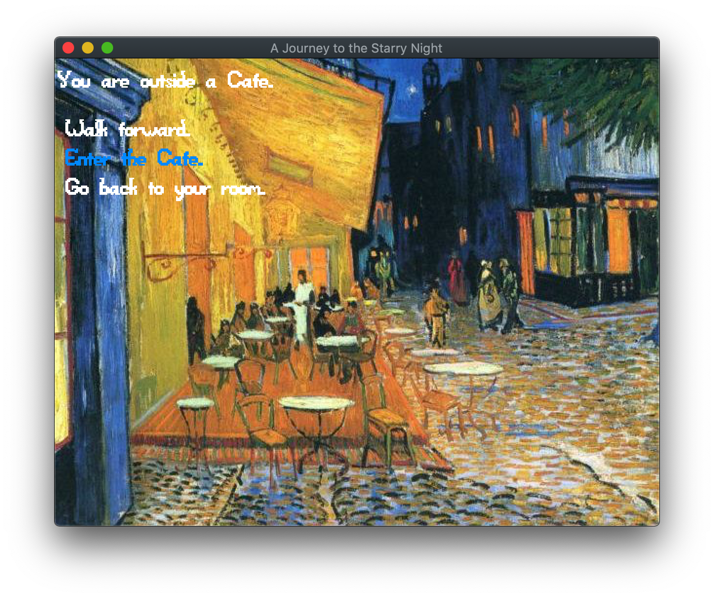

# A Journey to The Starry Night

Author: Haomin Wang (haominw)

Design: This is a choice-based game about a journey to the starry night.

Screen Shot:

How To Play:

Press UP/DOWN keys to switch between options. Press ENTER to make your choice.
There are two endings.

Art Sources:
Paintings by Vincent van Gogh (downloaded at https://www.vangoghgallery.com/painting/)
(The author died in 1890, so all his work are in the public domain in its country of origin and other countries and areas where the copyright term is the author's life plus 100 years or less.)

This game was built with [NEST](NEST.md).
